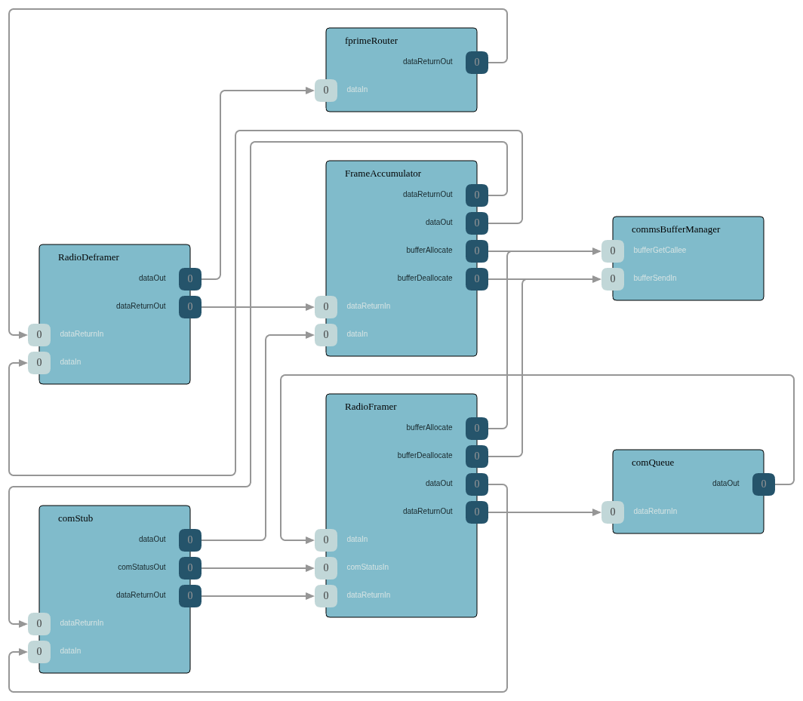

# Radio Communication Stack for F' (Structural Reference)

> Image generated using `fprime-util visualize` inside `Deployments/RadioDeployment/Top/`.

## Overview

An open-source, F' (F Prime) structural scaffolding for a generic radio communication stack. It wires custom framer/deframer/frame-detector components into the standard F' communication services (`ComQueue`, `FprimeRouter`, `BufferManager`, `ComStub`) so an operator can drop in their own licensed framing logic without reinventing the topology.

The framing logic itself is intentionally a stub — see [docs/USAGE_GUIDE.md](docs/USAGE_GUIDE.md) for how to inject your hardware's parameters via `keys_template/TransceiverConfig.hpp` and implement the marked stub bodies.

## Key Features

- **F' architectural reference** demonstrating a complete, modular communication stack using standard F' components.
- **Reusable FPP subtopology** (`RadioProtocol`) that can be imported into any F' deployment.
- **Management components**: `TransceiverCommsManager` for beacon state management and `TransceiverConfigurationManager` for I2C-based radio configuration.
- **Configuration injection layer** (`keys_template/`) for keeping radio-specific parameters (sync words, polynomials, callsigns) out of the public repository.

## Getting Started

### Prerequisites

- [F' (F Prime) Framework](https://fprime.jpl.nasa.gov/latest/docs/getting-started/) installed and configured.

### Using the Comm Stack in Your Project

1. **Import the subtopology**: in your deployment's `topology.fpp`, import the `RadioProtocol` subtopology.
2. **Inject configuration**: copy `keys_template/TransceiverConfig.hpp.example` to your deployment's config directory, rename to `TransceiverConfig.hpp`, and populate it with the values from your radio's datasheet.
3. **Implement the stubs**: fill in the marked stub bodies in the `.cpp` files under `LinkProtocols/RadioLinkProtocol/`.

## Repository Structure

- `Components/` — high-level management components (beacon management, I2C configuration).
- `LinkProtocols/` — framer / deframer / frame-detector scaffolding.
- `Deployments/` — example F' deployment demonstrating stack integration.
- `keys_template/` — configuration templates for the injection layer.

## Documentation

- [docs/USAGE_GUIDE.md](docs/USAGE_GUIDE.md) — step-by-step integration guide.
- [docs/ARCHITECTURE.md](docs/ARCHITECTURE.md) — architectural specification.
- [LinkProtocols/RadioLinkProtocol/README.md](LinkProtocols/RadioLinkProtocol/README.md) — framing stack details.
